# jenkinsfile
Jenkinsfile de exemplos


Vamos exercitar fazendo um pipeline usando o jenkins, não se preocupe em fazer todo o processo de instalação do mesmo, irei usar um *Vagrantfile* de um colega @João Pedro Silva, então, mão na massa:

Vamos clonar o repositório do nosso colega e entre os vários templetes, iremos usar o jenkins com os seguintes passos:

```
git clone https://github.com/joao-prs/vagrantfiles.git
cd vagrantfiles/jenkins/
vagrant up
```

Com isso teremos nosso ambiente pronto para usar:
```
$ vagrant status

Current machine states:

jenkins                   running (libvirt)
server                    running (libvirt)
```

Vamos fazer login no jenkins: https://192.168.121.10:8080/

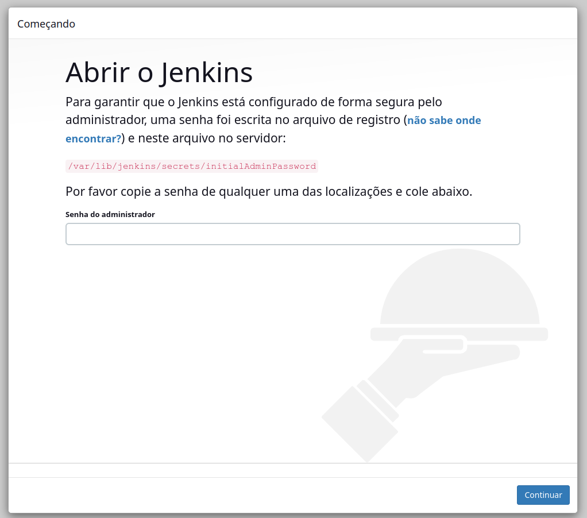

Iniciando o credenciamento, além da credencial do admin do jenkins, iremos criar a autenticação do *DockerHub* e *kubernetes*, iremos usar no *pipeline*:

```
scp -o StrictHostKeyChecking=no vagrant@192.168.121.10:~/pass .
cat pass
```
Em seguida poderemos instalar as extensões sugeridas:

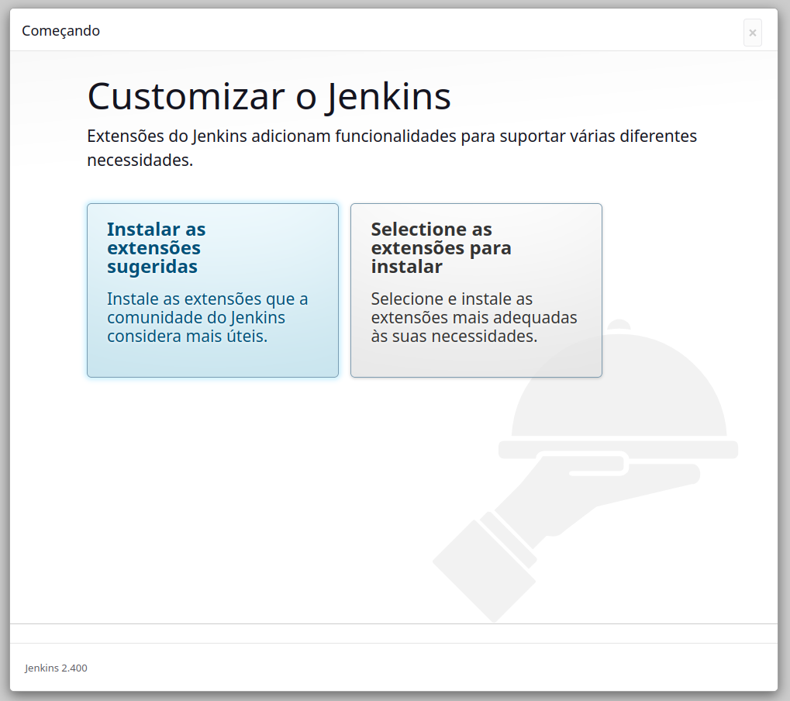
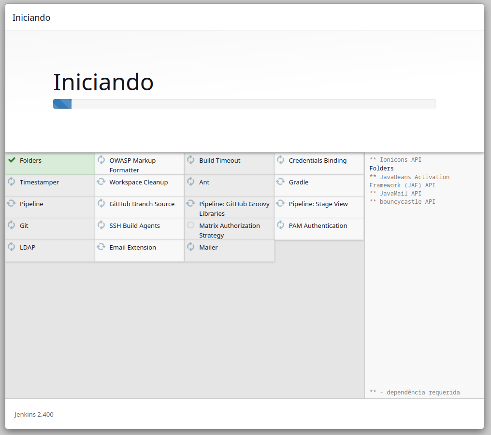

A próxima tela será para criar um usuário administrativo, nesse passo irei pular, não é recomendado em ambiente de produção, depois grave e conclua e comece a usar o jenkins.

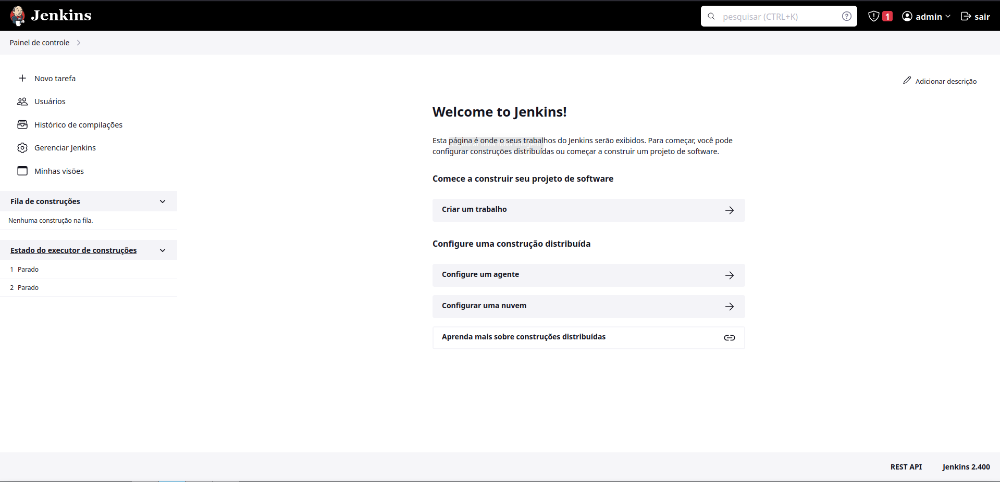

Configuração do token para acesso do kubernetes:
```
scp -o StrictHostKeyChecking=no vagrant@192.168.121.11:~/config .
```
Em *Painel de controle > Gerenciar Jenkins > Credentials > System > Global credentials (unrestricted) > Add Credentials*

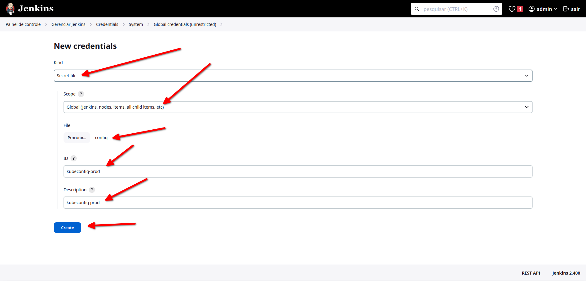
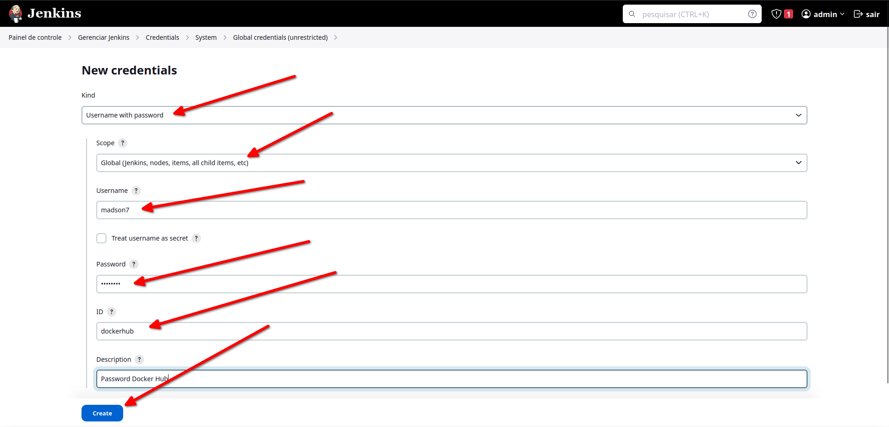

Configure também os plugins, *Painel de controle > Gerenciar Jenkins > Plugins Extensões disponíveis*

Instale as seguintes extensões:

* Docker API Plugin
* Docker Commons Plugin
* docker-build-step
* Docker
* Docker Pipeline
* kubernetes

## Pipeline

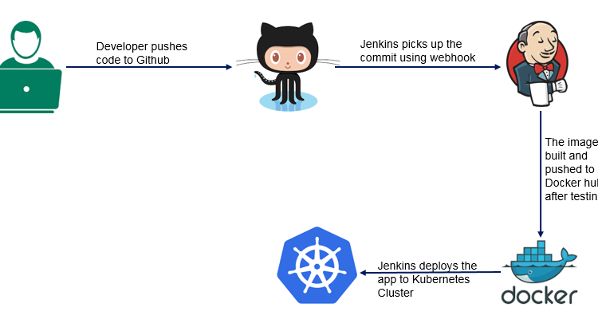

Agora com todas as dependências instaladas e configuradas iremos construir a nossa primeiro pipeline.

Em *Painel de controle* clique no botão *Nova tarefa* daremos um nome e escolheremos a opção *Pipeline*

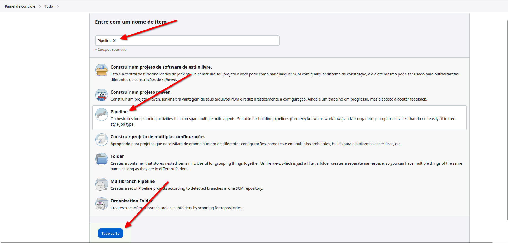
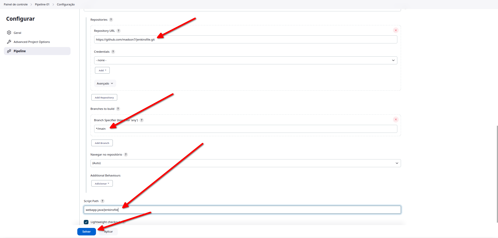
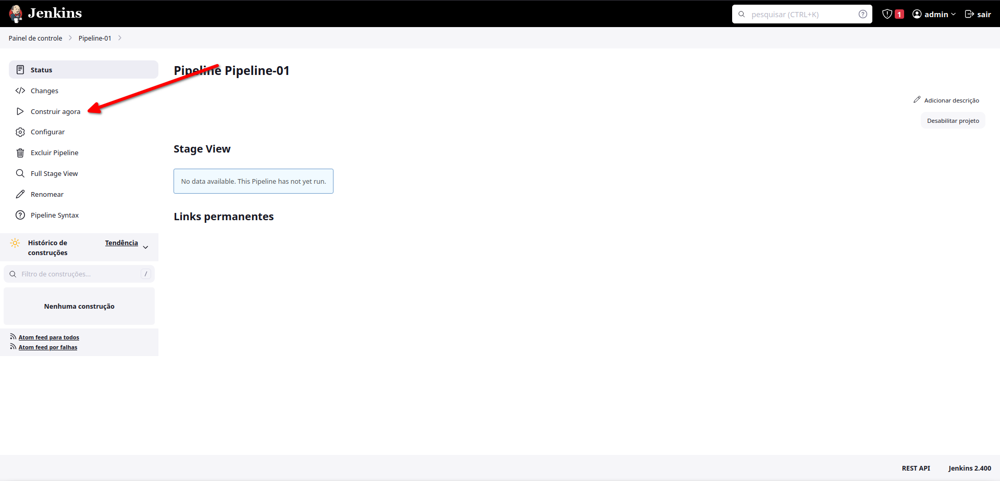
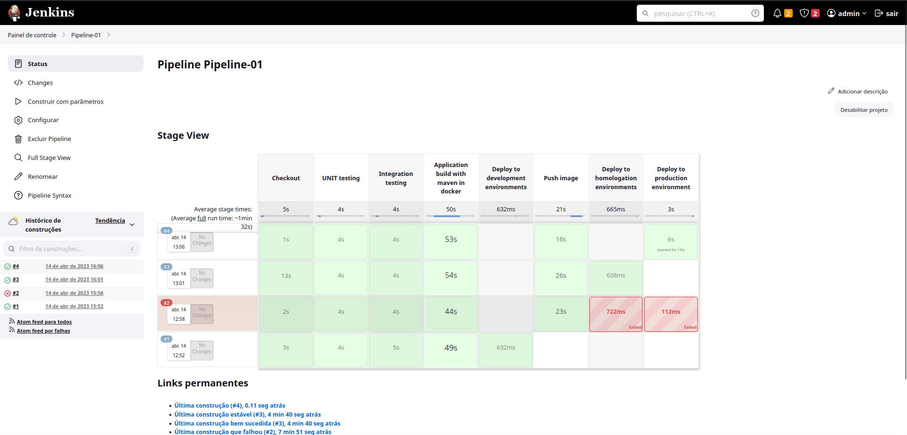

No print acima veremos os diferentes estágios do pipeline em diferentes execuções com uma demonstração de erro na segunda execução, além do último estágio requer uma aprovação.

Dessa forma teremos nosso webapp testado e implantado em ambiente de desenvolvimento homologação e produção.

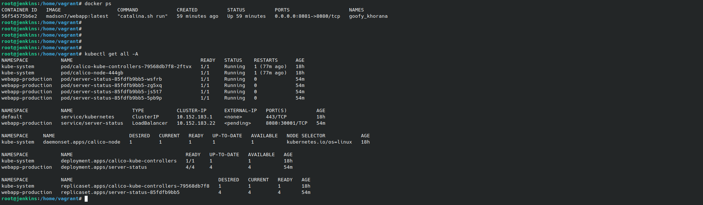


### Links

* Aplicação
    - https://github.com/madson7/dev
* Vagrantefile
    - https://github.com/joao-prs/vagrantfiles
* Jenkins
    - https://pkg.jenkins.io/debian/

